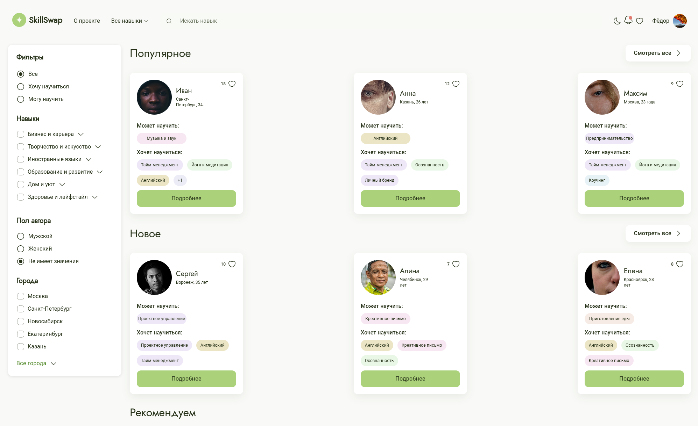
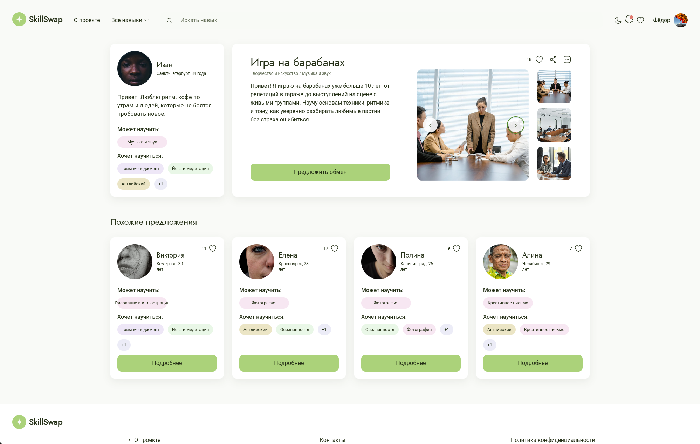
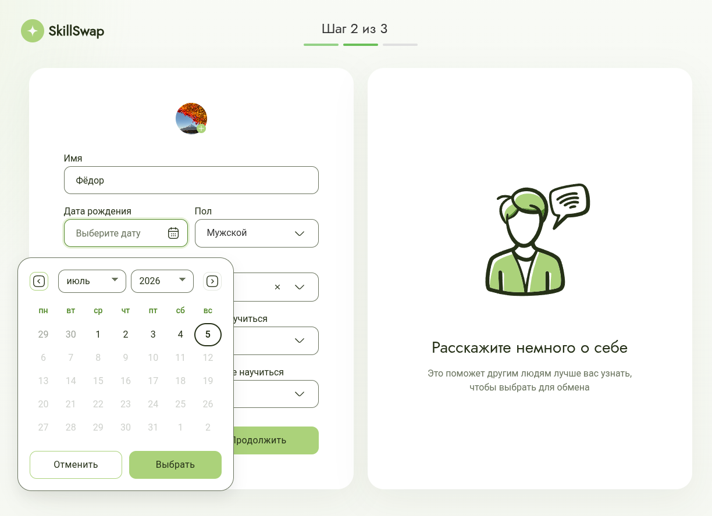
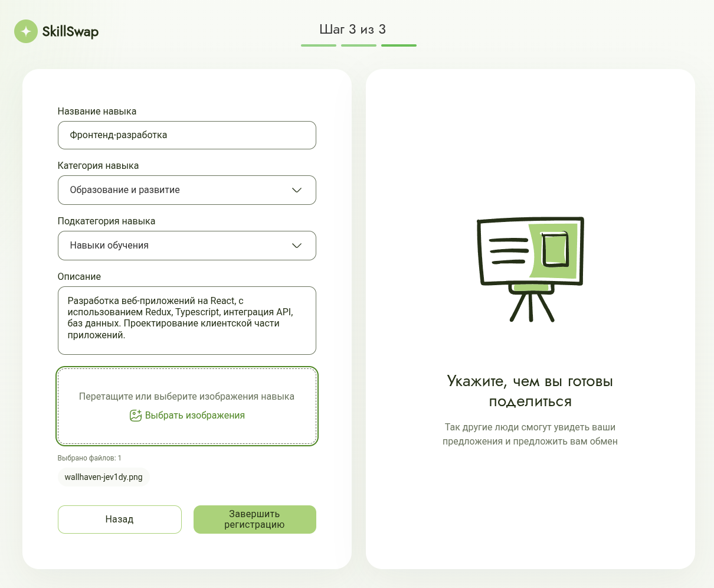
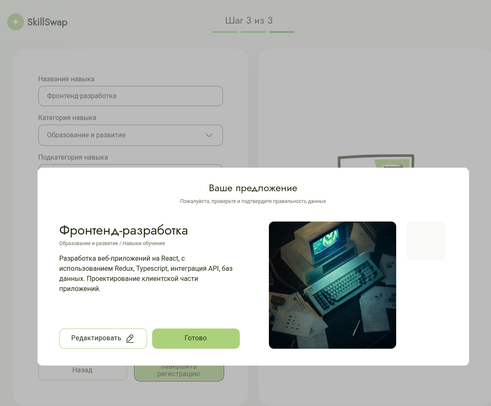

# Hi, I'm Fedor 👋

Frontend Developer specializing in React and TypeScript, passionate about building fast, scalable and user-friendly web applications.

I'm currently studying Applied Informatics while gaining commercial experience and building personal projects. I enjoy solving complex UI challenges, writing maintainable code and continuously improving my skills.

## Tech Stack

          	   

## Featured Projects

### 🍔 Stellar Burgers

<table>
    <tr>
        <td align="center">
            
             <b>Main Page</b>
        </td>
        <td align="center">
            
             <b>Registration</b>
        </td>
        <td align="center">
            
             <b>Order History</b>
        </td>
        <td align="center">
              
               <b>Order Feed</b>
          </td>
    </tr>
</table>

Production-like burger ordering application built with React and TypeScript.

**Tech Stack**

React • TypeScript • Redux Toolkit • React Router • REST API

**Key Features**

- Authentication & protected routes
- Drag & Drop burger constructor
- Order history
- Responsive UI

🔗 Repository: https://github.com/fndya/stellar-burgers

---

## 🎫 Helpdesk System (In Progress)

Fullstack helpdesk platform inspired by Jira Service Management and Zendesk.

**Tech Stack**

React • TypeScript • Redux Toolkit • NestJS • PostgreSQL • Docker • JWT

**Key Features**

- Ticket management system
- Role-based access control (RBAC)
- JWT Authentication + Refresh Tokens
- REST API
- PostgreSQL database
- Dockerized application

---

## 🤝 SkillSwap

<table>
    <tr>
        <td align="center">
            
             <b>Home Page</b>
        </td>
        <td align="center">
            
             <b>Offer Details</b>
        </td>
    </tr>
</table>
<table>    
    <tr>
        <td align="center">
            
             <b>Registration</b>
        </td>
        <td align="center">
            
             <b>Create Offer</b>
        </td>
        <td align="center">
            
             <b>Offer Preview</b>
        </td>
    </tr>
</table>

Team project for sharing knowledge and skills between users.

**Tech Stack**

React • TypeScript • Feature-Sliced Design • React Hook Form

**Key Features**

- Custom DatePicker component
- UI Kit integration
- Feature-Sliced Design architecture
- Team development using Git Flow

---

## 🎵 VK Music Transfer Extension

Chrome Extension for transferring music libraries into VK Music.

**Tech Stack**

TypeScript • JavaScript • Chrome Extensions API • DOM API

**Key Features**

- Manifest V3
- Chrome Storage API
- Automatic import
- MutationObserver
- Persistent state
- Overlay UI

🔗 Repository: https://github.com/fndya/vk-music-importer

---

### Currently Exploring
- Next.js
- Node.js
- NestJS
- Express.js
- Playwright
- Python

## About me

- 💻 Frontend Developer with an interest in Fullstack development
- 🚀 Looking for Junior / Junior+ opportunities
- 📚 Always learning new technologies
- ❤️ Love building real products

## Contacts

