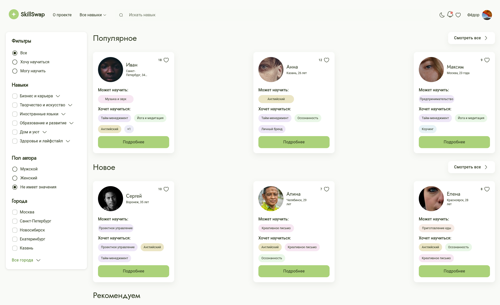
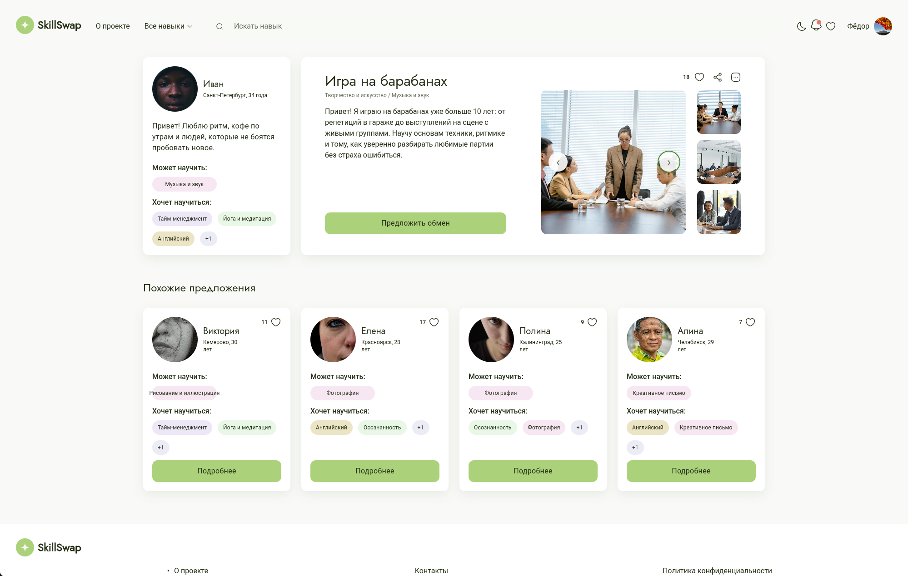
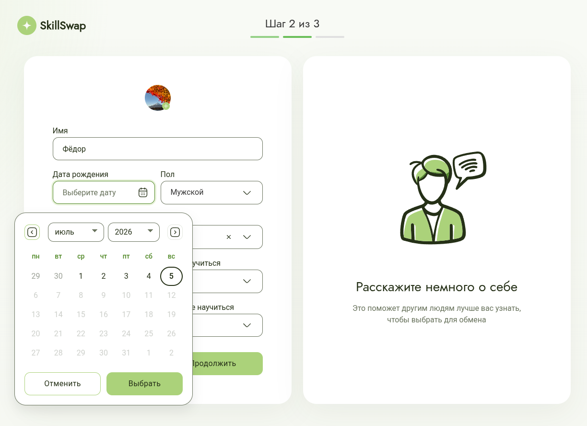
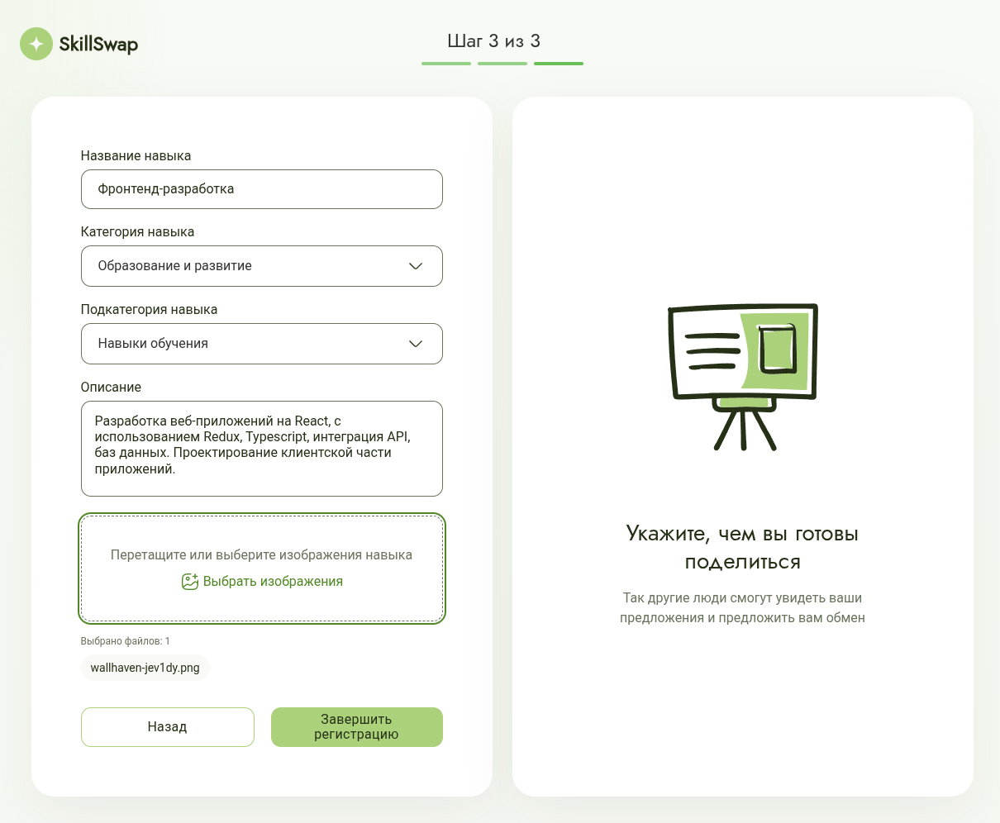
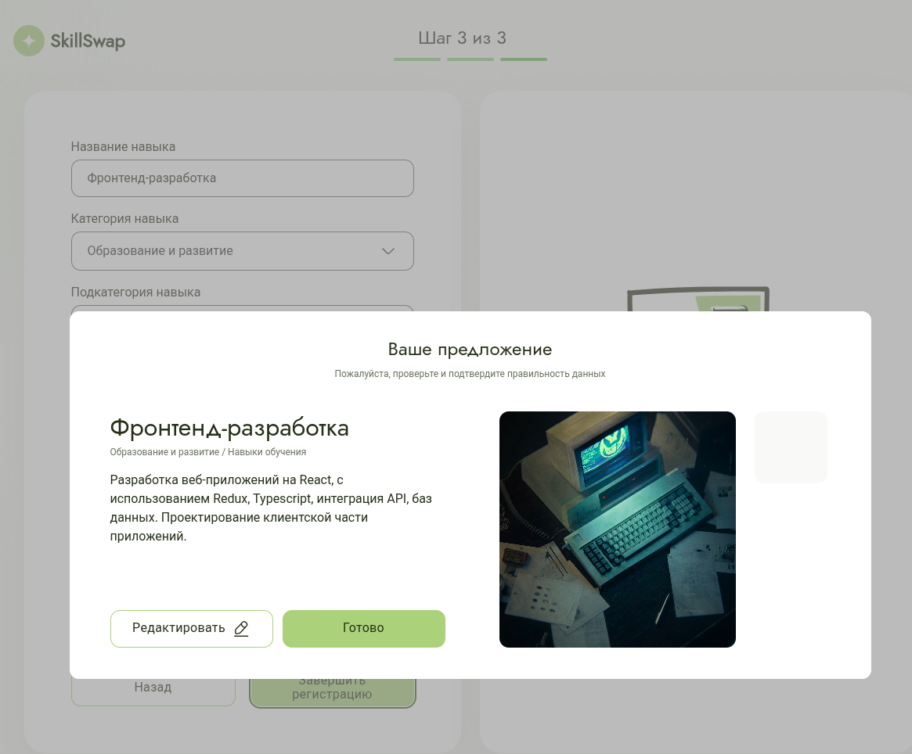

## Hi, I'm Fedor 👋

Full-Stack Developer focused on React, TypeScript and NestJS.

I build modern web applications with clean architecture, REST APIs and responsive user interfaces. Passionate about writing maintainable code, learning new technologies and solving real-world problems.

## Tech Stack

              		     

## Featured Projects

### 🍔 Stellar Burgers

<table>
    <tr>
        <td align="center">
            
             <b>Main Page</b>
        </td>
        <td align="center">
            
             <b>Registration</b>
        </td>
        <td align="center">
            
             <b>Order History</b>
        </td>
        <td align="center">
              
               <b>Order Feed</b>
          </td>
    </tr>
</table>

Production-like burger ordering application built with React and TypeScript.

**Tech Stack**

React • TypeScript • Redux Toolkit • React Router • REST API

**Key Features**

- Authentication & protected routes
- Drag & Drop burger constructor
- Order history
- Responsive UI

🔗 Repository: https://github.com/fndya/stellar-burgers

---

### 🖥️ Hosting Provider

A full-stack hosting platform built with **Django, DRF, React and TypeScript**, featuring authentication, role-based access control, tariffs, cart, orders, server provisioning, Redis/Celery background tasks and an administrative panel.

**Tech Stack:** 
Python · Django · DRF · React · TypeScript · Redis · Celery · SQLite

**Key features:** 
Authentication & RBAC · REST API · Tariffs · Shopping cart · Orders · Balance · Demo provisioning · Admin panel · Background tasks · PDF generation · Import/export · Change history

🔗 Repository: https://github.com/fndya/webdev_hosting-project

---

## 🤝 SkillSwap

<table>
    <tr>
        <td align="center">
            
             <b>Home Page</b>
        </td>
        <td align="center">
            
             <b>Offer Details</b>
        </td>
    </tr>
</table>
<table>    
    <tr>
        <td align="center">
            
             <b>Registration</b>
        </td>
        <td align="center">
            
             <b>Create Offer</b>
        </td>
        <td align="center">
            
             <b>Offer Preview</b>
        </td>
    </tr>
</table>

Team project for sharing knowledge and skills between users.

**Tech Stack**

React • TypeScript • Feature-Sliced Design • React Hook Form

**Key Features**

- Custom DatePicker component
- UI Kit integration
- Feature-Sliced Design architecture
- Team development using Git Flow

---

### Currently Exploring
- Next.js
- Express.js
- PHP
- Laravel
- Playwright
- Python
- Django

## About me

- 💻 Frontend Developer with an interest in Fullstack development
- 🚀 Looking for Junior / Junior+ opportunities
- 📚 Always learning new technologies
- ❤️ Love building real products
- 🖥️ My favourite WM is 

## Contacts

 
